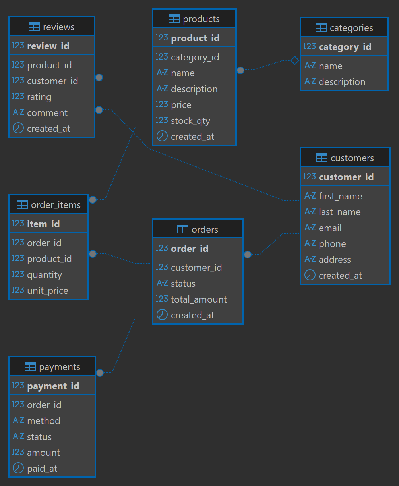

# DatabasesAndBigData_FinalProject_OzgurOnen_GH1044899
E-Commerce relational database system designed and implemented using MySQL and DBeaver.

# E-Commerce Database System
**B103 Databases & Big Data — Gisma University of Applied Sciences**

## Student Information
- **Name:** Ozgur Onen
- **Student ID:** GH1044899
- **Video Demo:** [Watch here](YOUR_VIDEO_LINK)

## Project Overview
A relational database system for an e-commerce platform built with MySQL and DBeaver.
Manages products, customers, orders, payments, and reviews.

## ER Diagram

## Repository Structure
| File | Description |
|------|-------------|
| `Schema.sql` | Creates the database and all 7 tables |
| `Indexes.sql` | Creates indexes for query optimization |
| `Data.sql` | Inserts sample data into all tables |
| `Queries.sql` | SQL queries demonstrating CRUD operations |

## Database Tables
- `categories` — product categories
- `products` — items available for purchase
- `customers` — registered users
- `orders` — customer orders
- `order_items` — individual items within each order
- `payments` — payment records per order
- `reviews` — customer reviews on products

## How to Run
1. Open DBeaver and connect to MySQL
2. Run `Schema.sql` to create the database and tables
3. Run `Indexes.sql` to add indexes
4. Run `Data.sql` to insert sample data
5. Run `Queries.sql` to execute all queries

## Tools Used
- MySQL
- DBeaver
